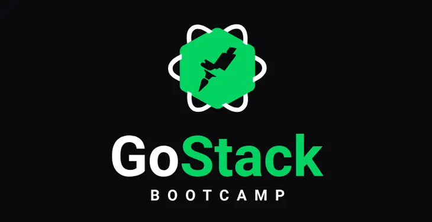
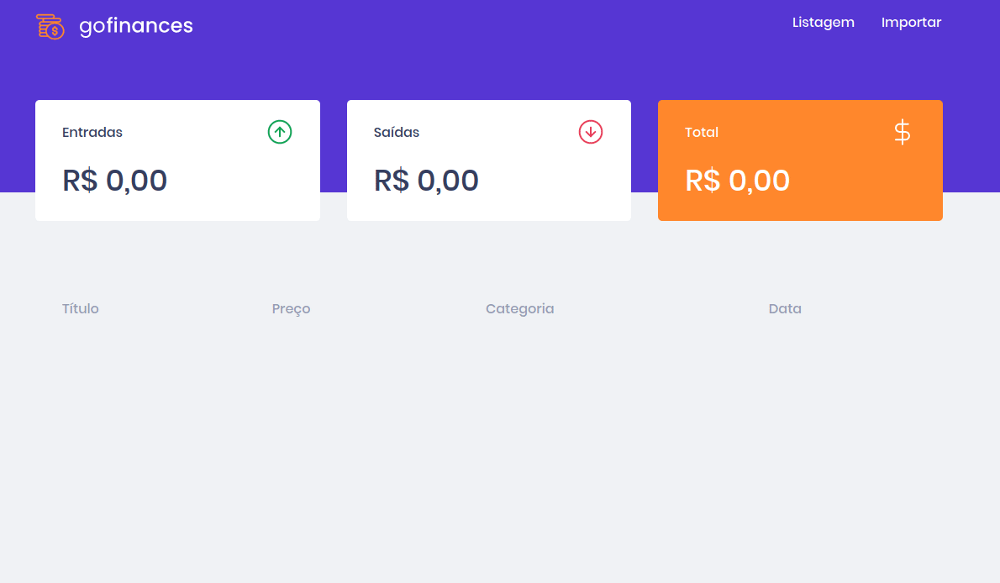

<p align="center">
  
</p>
<h3 align="center"> Desafio 7 - GoFinances Web</h3>
<p>
<p>

## Sobre:
Criamos o front-end para nossa aplicação de gestão de transações e integramos ao back-end que criamos no [**desafio 6**](https://github.com/muriloportugal/bootcamp11-desafio6-Banco-de-dados-e-upload-de-arquivos-no-nodejs).



[Detalhes do desafio](https://github.com/Rocketseat/bootcamp-gostack-desafios/tree/master/desafio-fundamentos-reactjs)

## Como testar:
Neste projeto foi utilizado o yarn, então caso ainda não tenha, siga este [guia parar instalação](https://classic.yarnpkg.com/en/docs/install) do mesmo.
Faça o download ou clone este repositório para o seu computador.
Entre na pasta "desafio7-gofinances-web" e rode o comando abaixo para que sejam instaladas as dependências:
```bash
yarn
```
:warning: É preciso estar executando o back-end que criamos no [**desafio 6**](https://github.com/muriloportugal/bootcamp11-desafio6-Banco-de-dados-e-upload-de-arquivos-no-nodejs) para que essa aplicação funcione.
```bash
yarn start
```

## :robot: Tecnologias:
- RactJS
- TypeScript

---
## :memo: Licença

Esse projeto está sob a licença MIT. Veja o arquivo [LICENSE](./LICENSE) para mais detalhes.
